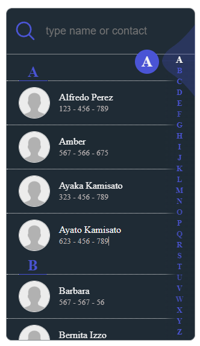

# NgxContactList | Angular 13+

Angular component for filtering contents in alphabetical listing, using default or custom templates. Ideal to build contact lists.

Compatible with previous versions of Angular, except AngularJS.

Spiritual successor of alphabet-filter [repository](https://github.com/ericferreira1992/alphabet-filter).

# Demo

See a [live demo](https://skyzerozx.github.io/ngx-contact-list).

## Simple use

```html
<ngx-contact-list
  [noSmoothScroll]="true"
  [withTemplate]="true"
  propAlphaOrder="name"
  [propsSearch]="['name' , 'lastName']"
  placeholder="type name or contact"
  [data]="contacts"
  height="550px"
>
  <ng-template let-item>
    <div>
      <span>{{item.name + ' ' + item.lastName}}</span>
    </div>
  </ng-template>
</ngx-contact-list>
```


## Custom use (with ng-template)

```html
<ngx-contact-list
  *ngIf="currentNumber === 2"
  [noSmoothScroll]="true"
  propAlphaOrder="name"
  [propsSearch]="['name' , 'lastName']"
  placeholder="type name or contact"
  [data]="contacts"
  listClass="search-list"
  [withTemplate]="true"
  height="550px"
>
  <ng-template let-item>
    <div class="search-list-item">
      
      <span>{{item.name + ' ' + item.lastName}}</span>
    </div>
  </ng-template>
</ngx-contact-list>
```



# Usage

## Install

`npm install ngx-contact-list`

## Import into Module

```typescript
import { NgxContactListModule } from 'ngx-contact-list';

@NgModule({
  imports: [
    ...,
    NgxContactListModule
  ],
  declarations: [...],
  providers: [],
  bootstrap: [AppComponent]
})
export class AppModule { }
```

## Insert into styles of `angular.json`

```json
...
"styles": [
  "...",
  "node_modules/ngx-contact-list/ngx-contact-list.scss"
],
...
```

## Custom Sytles

_In styles.scss or style of proyect_

```scss
...
 /*Custom Styles for ngx contact list */
$color-contact-list : rgb(75, 77, 218) ;
$background-contact-list :#1B2B35;
$color-text :  WhiteSmoke;
$color-input-search : WhiteSmoke;
$border-line-style :  solid;
@import '/node_modules/ngx-contact-list/ngx-contact-list.scss';
...
```

# API

## Inputs/Outputs (Required)

| Name             | Type                | Description                                                                                                  |
| ---------------- | ------------------- | ------------------------------------------------------------------------------------------------------------ |
| `data`           | `any[]`             | Data to be listed.(ex .: ` <... [data]="contacts"></...>`).                                                  |
| `propAlphaOrder` | `string`            | Property for name of the property to be ordered alphabetically.(ex .: ` <... propAlphaOrder="name"></...>`). |
| `propsSearch`    | `string[]`          | Property(ies) to be filtered.(ex .: ` <... [propsSearch]="['name']"></...>`).                                |
| `onClick`        | `EventEmitter<any>` | Emit on item click.(ex .: ` <... (onClick)="selected($event)"></...>`).                                      |

## Inputs/Outputs (Optional)

| Name           | Type                | Description                                                                                     |
| -------------- | ------------------- | ----------------------------------------------------------------------------------------------- |
| `placeholder`  | `string`            | Placeholder of input filter. (ex .: ` <... []=""></...>`).                                      |
| `listClass`    | `string`            | Class name for list element. (ex .: ` <... listClass="search-list"></...>`).                    |
| `height`       | `string`            | Height to be used throughout the component. (ex .: ` <... height="100%"></...>`).               |
| `withTemplate` | `boolean`           | Used when to need of customize using ng-template. (ex .: ` <... [withTemplate]="true"></...>`). |
| `onCancel`     | `EventEmitter<any>` | Used to enable "close" button.(ex .: ` <... (onCancel)="cancel()"></...>`).                     |
